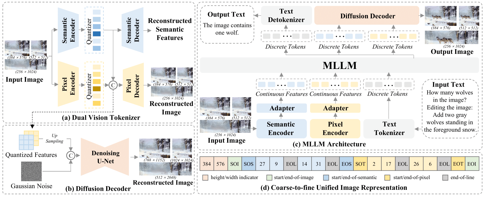
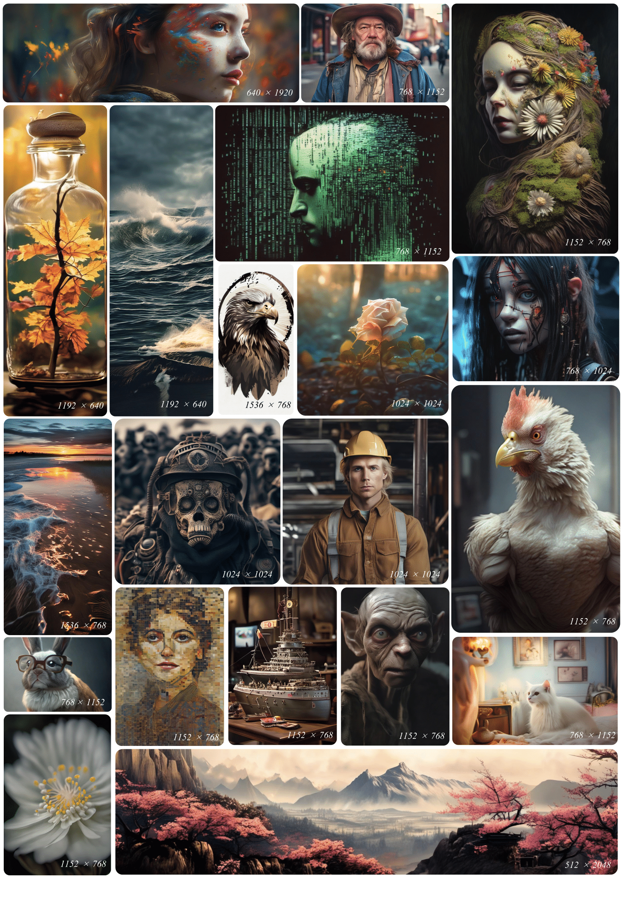
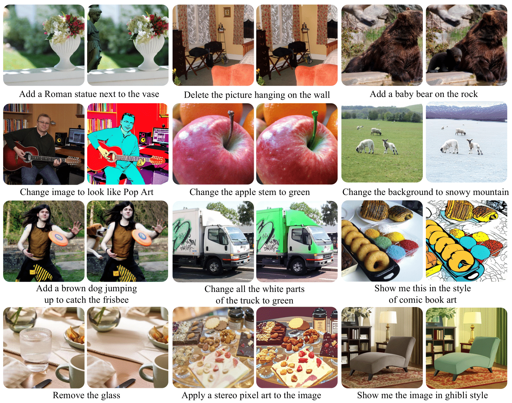

<div align="center">

</img>

# **ILLUME+: Illuminating Unified MLLM with Dual Visual Tokenization and Diffusion Refinement**


📄 [Paper](https://arxiv.org/abs/2504.01934) | 🌐 [Project-Page](https://illume-unified-mllm.github.io/) | 🤗 [ILLUME+ Models](https://huggingface.co/collections/ILLUME-MLLM/illume-models-683b3916f5af2d0a015b3477) | 🤗 [ILLUME+ Demo](https://huggingface.co/spaces/ILLUME-MLLM/ILLUME_plus-7b) <br/>


</div>

Welcome to the official repository for our paper: "ILLUME+: Illuminating Unified MLLM with Dual Visual Tokenization and Diffusion Refinement"


## **Abstract**
We present ILLUME+ that leverages dual visual tokenization and a diffusion decoder to improve both deep semantic understanding and high-fidelity image generation. 
ILLUME+ introduces a unified dual visual tokenizer, DualViTok, which preserves both fine-grained textures and text-aligned semantics while enabling a coarse-to-fine image representation strategy for multimodal understanding and generation. Additionally, we employ a diffusion model as the image detokenizer for enhanced generation quality and efficient super-resolution. 
ILLUME+ follows a continuous-input, discrete-output scheme within the unified Multimodal Large Language Model (MLLM) and adopts a progressive training procedure that supports dynamic resolution across the vision tokenizer, MLLM, and diffusion decoder. 
ILLUME+ (3B) exhibits competitive performance against existing unified MLLMs and specialized models across multimodal understanding, generation, and editing benchmarks. 
With its strong performance, ILLUME+ provides a scalable and versatile foundation for future multimodal applications. 

<div align="center">
  </img>
</div>


## TODO

- [x] Release model checkpoint and inference code.
- [x] Release training and inference code for the vision tokenizer and MLLM.
- [x] Release 7B LLM checkpoint.
- [ ] Release training code for the diffusion decoder.


## Model Checkpoint


### MLLM
| Model Name | 🤗 HF Format | Origin Format |                                   Config                                   |
| :--------: | :------------: | :----------: |:--------------------------------------------------------------------------:|
| ILLUME+ 3B | [Link](https://huggingface.co/ILLUME-MLLM/illume_plus-qwen2_5-3b-hf) | [Link](https://huggingface.co/ILLUME-MLLM/illume_plus-qwen2_5-3b) | [Config](configs/example/illume_plus_3b/illume_plus_qwen2_5_3b_stage3.py) |
| ILLUME+ 7B | [Link](https://huggingface.co/ILLUME-MLLM/illume_plus-qwen2_5-7b-hf) | [Link](https://huggingface.co/ILLUME-MLLM/illume_plus-qwen2_5-7b) | [Config](configs/example/illume_plus_7b/illume_plus_qwen2_5_7b_stage3.py) |

<details>
<summary>Performance</summary>

### Image Understanding Performance
| Model      | POPE | MMBench | SEED | MME-P | MM-Vet | MMMU | AI2D | VQA-text | ChartQA | DocVQA | InfoVQA | OCRBench |
|------------|-----:|--------:|-----:|------:|-------:|-----:|-----:|---------:|--------:|-------:|--------:|---------:|
| ILLUME+ 3B  | 87.6 |  80.8   | 73.3 | 1414.0|  40.3  | 44.3 | 74.2 |   69.9   |  69.9   |  80.8  |   44.1  |   672    |
| ILLUME+ 7B  | 88.7 |  79.3   | 74.3 | 1547.1|  47.7  | 37.6 | 78.0 |   75.2   |  82.1   | 88.6 | 0.5745 |   772    |

### Image Generation Performance
<table>
  <thead>
    <tr>
      <th rowspan="2">Model</th>
      <th rowspan="2">MJHQ30k<br>FID&nbsp;↓</th>
      <th colspan="2">GenAI-bench</th>
      <th colspan="7">GenEval</th>
    </tr>
    <tr>
      <th>Basic</th>
      <th>Advanced</th>
      <th>Overall</th>
      <th>Single&nbsp;Obj</th>
      <th>Two&nbsp;Obj</th>
      <th>Counting</th>
      <th>Colors</th>
      <th>Position</th>
      <th>Color&nbsp;Attri.</th>
    </tr>
  </thead>
  <tbody>
    <tr>
      <td>ILLUME+ 3B</td>
      <td>6.00</td>
      <td>0.72</td>
      <td>0.71</td>
      <td>0.72</td>
      <td>0.99</td>
      <td>0.88</td>
      <td>0.62</td>
      <td>0.84</td>
      <td>0.42</td>
      <td>0.53</td>
    </tr>
    <tr>
      <td>ILLUME+ 7B</td>
      <td>5.78</td>
      <td>0.72</td>
      <td>0.72</td>
      <td>0.74</td>
      <td>0.99</td>
      <td>0.88</td>
      <td>0.60</td>
      <td>0.87</td>
      <td>0.54</td>
      <td>0.58</td>
    </tr>
  </tbody>
</table>

Note that the data for training the 7B model is slightly different to the 3B model.
</details>

### Vision Tokenizer
| Model Name | Codebook Size |  Checkpoint | Config  | Diffusion Decoder   |
| :--------: |  :------------: | :------------: | :----------: | :----------------------------------------------------------: |
| DualViTok  | 32K(Sem) + 98K(pixel) |  [Link](https://huggingface.co/ILLUME-MLLM/dualvitok) | [Config](configs/example/dualvitok/dualvitok_anyres_max512.py) | [SDXL](https://huggingface.co/ILLUME-MLLM/dualvitok-sdxl-decoder) |

## Setup & Installation

### Prepare the environment

1. Set up environment
```shell
git clone https://github.com/illume-unified-mllm/ILLUME_plus
cd ILLUME_plus
conda create -n illume python==3.9 -y
conda activate illume
```

2. Install the required packages (note that instructions are different from GPUs and NPUs):
```shell
cd ILLUME_plus 

export CODE_DIR=$(pwd)

# make sure you set the environment variables
export PYTHONPATH=$PYTHONPATH:$CODE_DIR/ILLUME/
export PYTHONPATH=$PYTHONPATH:$CODE_DIR/vision_tokenizer/

# upgrade pip and setuptools if necessary
pip install -U pip setuptools

# install packages for ILLUME
cd $CODE_DIR/ILLUME
pip install -e . 		# for NVIDIA GPUs 
pip install -e ".[npu]"	# OR for Ascend NPUs 

# (GPU only) install flash attention for better efficiency
pip install flash-attn --no-build-isolation
```

### Download Pre-trained Models
This section consolidates the download steps for all necessary pre-trained models. Ensure these are downloaded before proceeding to demos or inference.

1.  **Download the ILLUME+ MLLM Checkpoint:**
    This is the main model checkpoint.
    ```shell
    huggingface-cli download ILLUME-MLLM/illume_plus-qwen2_5-3b --local-dir=checkpoints/illume_plus-qwen2_5-3b
    ```

2.  **Download the DualViTok (Vision Tokenizer) Checkpoint:**
    This checkpoint is for the vision tokenizer.
    ```shell
    huggingface-cli download ILLUME-MLLM/dualvitok --local-dir=checkpoints/dualvitok
    ```

3.  **Download the SDXL Decoder Model:**
    This model is used for decoding images during generation.
    ```shell
    huggingface-cli download ILLUME-MLLM/dualvitok-sdxl-decoder --local-dir=checkpoints/dualvitok-sdxl-decoder
    ```


## Demos and Inference

### Simple Inference Example with 🤗 HuggingFace

Please check our model's usage and inference examples on HuggingFace: [illume_plus-qwen2_5-3b-hf](https://huggingface.co/ILLUME-MLLM/illume_plus-qwen2_5-3b-hf)


### Inference Example with codebase

To run inference using the models downloaded in the ["Setup & Installation"](#setup--installation) section:
Then follow [inference.ipynb](ILLUME/inference.ipynb).

### MLLM Demo

Try out **ILLUME+** in your browser using our interactive [Demo](https://huggingface.co/spaces/ILLUME-MLLM/ILLUME_plus)

To host your own demo locally, follow these steps:

```shell
# using 🤗 HF format checkpoint.
cd ILLUME
python app_hf.py \
--model_name ILLUME-MLLM/illume_plus-qwen2_5-3b-hf/ \
--diffusion_decoder_path ILLUME-MLLM/dualvitok-sdxl-decoder \
--tokenizer_path ILLUME-MLLM/dualvitok  \
--torch_dtype bf16

# Using the origin format checkpoint.
cd ILLUME

## Create the link to the `output_dir` defined in config.
mkdir -p ./logdir/illume_plus_3b/
ln -s $(pwd)/../checkpoints/illume_plus-qwen2_5-3b $(pwd)/logdir/illume_plus_3b/illume_plus-qwen2_5-3b_stage3/

## Run the app.py
python app.py --config ../configs/example/illume_plus_3b/illume_plus_qwen2_5_3b_stage3.py  \
  --tokenizer_config ../configs/example/dualvitok/dualvitok_anyres_max512.py \
  --tokenizer_checkpoint ../checkpoints/dualvitok/pytorch_model.bin \
  --diffusion_decoder_path ../checkpoints/dualvitok-sdxl-decoder \
  --torch_dtype=bf16
```

Note that we implement [InterleavedLogitsProcessor](ILLUME/generation_eval/models/inference_utils.py#L477) in inference for three key reasons:
1. To activate the image generation mode with classifier-free guidance when meeting `<start_of_image>` tokens.
2. To handle the varying number of image tokens across different resolutions and ensure proper alignment between semantic-level tokens and pixel-level tokens in each line.
3. To prevent sampling of incorrect modality tokens when `do_sample=True` is enabled during text or image generation.

### Vision Tokenizer Demo

```shell
cd vision_tokenizer

python app.py ../configs/example/dualvitok/dualvitok_anyres_max512.py \
  --vq-ckpt ../checkpoints/dualvitok/pytorch_model.bin \
  --sdxl-decoder-path ../checkpoints/dualvitok-sdxl-decoder
```

## Training Models

### Training DualViTok (Vision Tokenizer)

To train the DualViTok, navigate to the `vision_tokenizer` directory and use the provided scripts.

We provide the examples to train the tokenizer on ImageNet. You could add more datase on the config file.

First, link the imagenet dataset as below.
```shell
cd vision_tokenizer
mkdir data
ln -s /path/to/imagenet_train_set/ ./data/imagenet_train

ln -s /path/to/imagenet_val_set/ ./data/imagenet_val
```

**Example 1. Training with fixed 256 resolution:**
This training uses images resized and center-cropped to 256x256.
```shell
cd vision_tokenizer
torchrun --nproc_per_node 8 tokenizer/train_dualvitok.py ../configs/example/dualvitok/dualvitok_fix256.py
```

**Example 2. Training with variable resolution (max 512x512):**
This training uses images with a maximum resolution of 512x512 and groups samples with similar resolutions into batches.
```shell
cd vision_tokenizer

# First, record all image size to json file. 
python scripts/read_folder_image_sizes.py --input_folder ./data/imagenet_train/ --output_json ./data/json_files/imagenet_train.json

# Then run the script to train vision tokenizer.
torchrun --nproc_per_node 8 tokenizer/train_dualvitok.py ../configs/example/dualvitok/dualvitok_anyres_max512.py 
```
    
### Evaluate DualViTok on ImageNet Val 50k.

We use the [torch_fidelity](https://github.com/toshas/torch-fidelity) to calculate the rFID. Make sure install this before your evaluation.

To run reconstruction inference on the ImageNet validation set (50k images):
```shell
cd vision_tokenizer
torchrun --nproc_per_node 8 tokenizer/reconstruction_vq_ddp.py ../configs/example/dualvitok/dualvitok_anyres_max512.py \
  --vq-ckpt=../checkpoints/dualvitok/pytorch_model.bin --model-dtype fp32
```
    
### Training MLLM
#### Preparation of data and model
Step 1: Prepare Data and Tokenizer Checkpoint
Please refer to [Data.md](assets/docs/Data.md).

Step 2: Prepare mllm
```shell
# extend vision codebook to the llm
python ILLUME/scripts/prepare_llm_with_extended_vision_tokenizer.py \
--model_path Qwen/Qwen2.5-3B-Instruct  \
--semantic_codebook_size 32768  \
--pixel_codebook_size 98304 \
--output_model_path checkpoints/Qwen2.5-3B-Instruct-with-vision-tokenizer-32k-96k-level2
```

#### Train

Configure `configs/example/illume_debug/illume_debug.py` and run the training command:

```shell
export PYTHONPATH=$PYTHONPATH:$CODE_DIR/ILLUME/
export PYTHONPATH=$PYTHONPATH:$CODE_DIR/vision_tokenizer/
cd ILLUME
torchrun --nproc_per_node=8 illume/train/train.py ../configs/example/illume_debug/illume_debug.py
```

If you want to finetune the pretrained model, modify the `data_args.language_model.pretrained_model_name_or_path` to the pretrained checkpoint:
```shell
torchrun --nproc_per_node=8 illume/train/train.py ../configs/example/illume_debug/illume_debug.py --model_args.language_model.pretrained_model_name_or_path='/path/to/checkpoints/'
```

### Evaluate MLLM

#### Evaluation on understanding benchmark

First, please install [lmms-eval](https://github.com/EvolvingLMMs-Lab/lmms-eval) to evaluate the image understanding tasks. The scripts evaluated on `lmms-eval=0.3.0`.

copy the files under ILLUME/scripts/lmms_eval/ to the lmms-eval/lmms_eval/ in the same structure.
```shell
git clone https://github.com/EvolvingLMMs-Lab/lmms-eval.git
cp ILLUME/scripts/lmms_eval/models/illume.py lmms-eval/lmms_eval/models/illume.py
cp ILLUME/scripts/lmms_eval/models/__init__.py lmms-eval/lmms_eval/models/__init__.py
cp ILLUME/scripts/lmms_eval/tasks/mme/* lmms-eval/lmms_eval/tasks/mme/
cd lmms-eval; 
git checkout v0.3.0
pip install -e . ; cd ..
```

Then, set the config in the `--model_args` to evaluate the specific model. The mllm ckpt should be in `training_args.output_dir` in the config `../configs/example/illume_plus_3b/illume_plus_qwen2_5_3b_stage3.py`. Running the following command:
    
```shell
cd ILLUME 
accelerate launch --num_processes 8 -m lmms_eval \
--model illume --tasks mme_nopost --batch_size 1 \
--log_samples --log_samples_suffix illume_plus_3b \
--output_path ./logs/ --model_args pretrained=../configs/example/illume_plus_3b/illume_plus_qwen2_5_3b_stage3.py
```

#### Inference on text-to-image generation task
The inference datasets are defined in [meta_dataset_configs.py](ILLUME/generation_eval/generation_dataset/meta_dataset_configs.py).

See test data format of examples in [t2i_test_examples.jsonl](configs/data_configs/test_data_example/Text2ImageExample/t2i_test_examples.jsonl).

To run text-to-image generation:
```shell
cd ILLUME
bash scripts/inference_text_to_image.sh
```

#### Inference on image editing task
The inference datasets are defined in [meta_dataset_configs.py](ILLUME/generation_eval/generation_dataset/meta_dataset_configs.py).

See test data format of examples in [edit_test_examples.jsonl](configs/data_configs/test_data_example/EditingSingleTurnExample/edit_test_examples.jsonl).
    
To run image editing inference:
```shell
cd ILLUME
bash scripts/inference_image_editing.sh
```

---

## Image Generation





## Image Editing





## Image Understanding


If you encounter any problems or have suggestions, please feel free to [open an issue](https://github.com/illume-unified-mllm/ILLUME_plus/issues) on our GitHub repository. We welcome your feedback and contributions!


We would like to acknowledge [LLaVA](https://github.com/haotian-liu/LLaVA), [EMOVA](https://github.com/emova-ollm/EMOVA), and [LlamaGen](https://github.com/FoundationVision/LlamaGen) for their inspiring work.


## Citation
If you find our paper helpful, please consider citing our papers and staring us!


    @article{huang2025illume_plus,
      title={ILLUME+: Illuminating Unified MLLM with Dual Visual Tokenization and Diffusion Refinement},
      author={Huang, Runhui and Wang, Chunwei and Yang, Junwei and Lu, Guansong and Yuan, Yunlong and Han, Jianhua and Hou, Lu and Zhang, Wei and Hong, Lanqing and Zhao, Hengshuang and Xu, Hang}
      journal={arXiv preprint arXiv:2504.01934},
      year={2025}
    }

